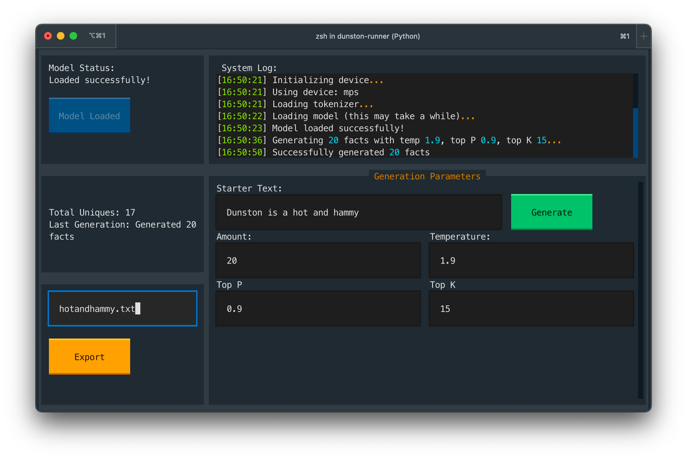

# dunston-runner
This is an early test of a TUI app to run some torch/ML stuff

## Installing
1. **Download this repo** - `git clone` or download this repo (green button in upper-right for a zip file)
2. **Install uv** - I'd recommend using `uv` to install what's needed and to run this. Follow uv's installation instructions [here](https://docs.astral.sh/uv/getting-started/installation/).
3. **Run this with uv** - Navigate to the `dunston-runner` folder and run `uv run dunston-runner.py`. The first time you do this, uv will download about 1-2gb of required (mostly torch) stuff. Afterwards, it'll be faster.

Eventually, you should see something like this:
   
## Using
After following step 3 above to launch:
1. Click the blue 'Load Model' button in the upper-left. Again, if this is the first time, it'll download the duston model, which about 2gb or so. Be patient because there's not much feedback here. It'll cache it for the future, though, just like the above torch stuff.
2. Once the model is loaded, focus on the 'Generation Parameters' pane. Set the temperature (2.0 is good for typical Dunston spiciness) and amount (I tend to generate 20-30 at a time - dupes will be removed), and finally of course a prompt mentioning Dunston (if you want). Then, press the green 'Generate' button. Depending upon your hardware and the amount of facts you asked for, this'll be quick or not. It should be under a minute for 20-30, at the absolute worst.
3. After you've generated as many facts as you want (Check 'Total Unique Facts' to see), you can enter a filename and press the orange 'Export Facts' button to export a text file in the same directory. You can press control-Q to quit this program, and read the text file if you want. Sorry, but the text file is what I use to import into my other bot so that's why it does this. Enjoy, or not!
